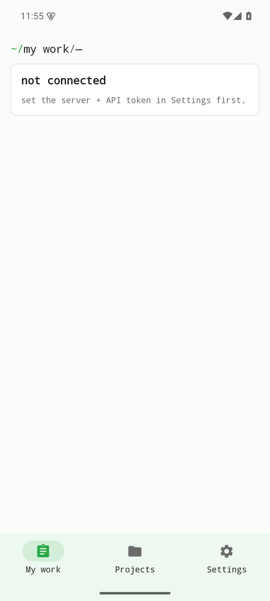
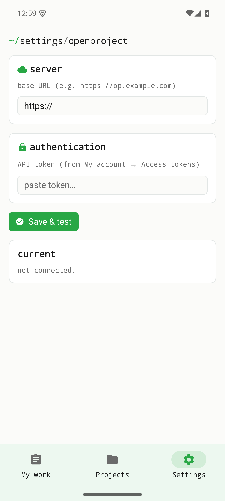

Projet is a lean, native client for a **self-hosted OpenProject** instance. It talks only to the server you point it at — there is no central service and no third party in between. Credentials live in the platform secure store (Android EncryptedSharedPreferences). The screenshots below are real captures of the v0.1.0 build.

## Not connected — the starting state

When you first open the app, no OpenProject server is configured yet. The home tab uses the suite's terminal-style breadcrumb and clearly states that nothing is connected — it points you to set the server and credentials in Settings first. Nothing is fetched until you connect.

{width=320}

## Settings — server & credentials

**Settings** is where you enter your OpenProject instance URL and your credentials. Once connected, the app talks directly to your server over OpenProject's official HAL+JSON API (v3) with bearer-token authentication — no other host is contacted.

{width=320}

## Backend-dependent screens

The data screens — the project list, work-package lists, detail views and the actions on them — require a **reachable OpenProject instance and valid credentials**. They are deliberately **not faked** here: they appear once you connect a server in Settings, fetching live content directly from your instance. A future capture against a test OpenProject instance will extend this page with those live data views.

## Where to get it

Projet is currently an **Android-only development build** — a signed APK you install yourself.

| Channel | App |
|---------|-----|
| Android (signed APK) — [GitHub Releases v0.1.0](https://github.com/etabli-dev/etabli-projet/releases/tag/v0.1.0) | **Development build** |
| App Store (iOS) | planned — not yet available |
| Google Play (Android) | planned — not yet available |
| F-Droid | planned — not yet available |
| Source code | [`etabli-dev/etabli-projet`](https://github.com/etabli-dev/etabli-projet) |
